# Linguagens e biliotecas usadas
Foi usado a linguagem Python e o Jupyter Notebook. Foram utilizadas as bibliotecas pandas, seaborn e statistics.
# Tratamento tempo

No arquivo tempo.csv, podemos observar alguns problemas que precisam passar por um tratamento.
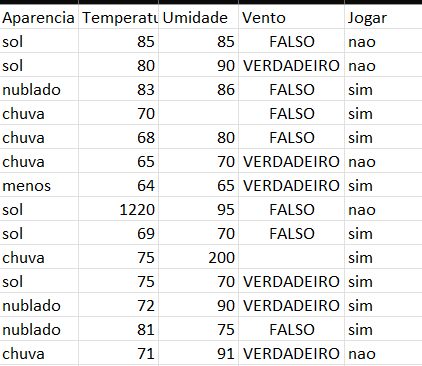

# Coluna Aparencia
Inicialmente, comecei importando a tabela e salvando-a na variável 'dataset'. Em seguida, utilizei 'dataset.head()' para visualizar a tabela.
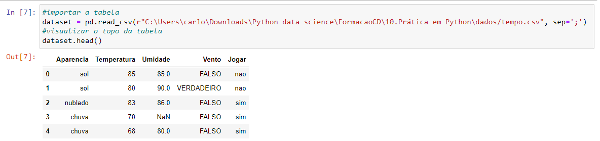
Posteriormente, iniciei o tratamento pela coluna 'Aparência'. Utilizei as funções 'groupby()' e 'size()' para agrupar os resultados da coluna e a quantidade. Notei que o resultado estava diferente, deveria ser menor.
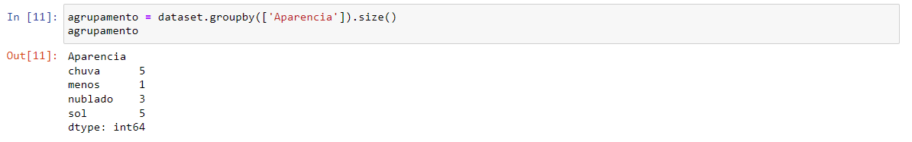
Então, tive que corrigir esse resultado e atribuí-lo à variável 'sol'.
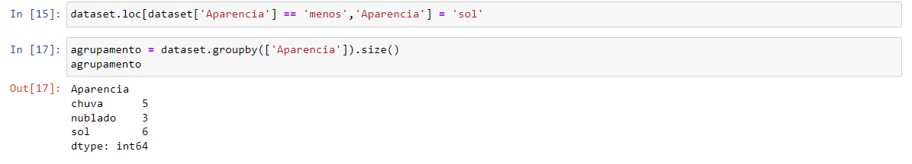
Mais adiante no processo, percebi que existiam valores numéricos salvos na coluna. Iniciei a alteração desses valores para 'sol'.
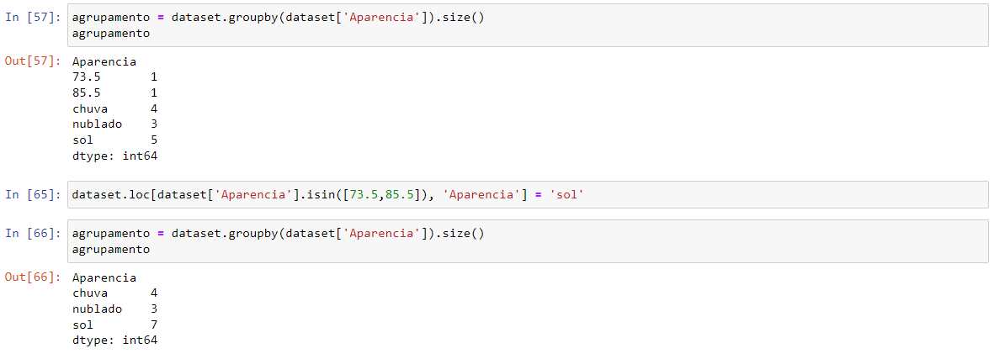

# Coluna Umidade
Na coluna 'Umidade', percebi, utilizando as funções 'groupby()' e 'size()', que havia um valor acima de 130, excedendo o valor esperado.
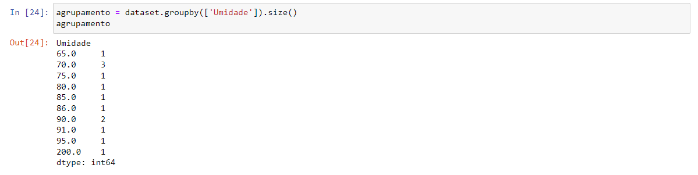
Também utilizei a função 'boxplot' da biblioteca 'statistics' para visualizar a mediana e os quartis.
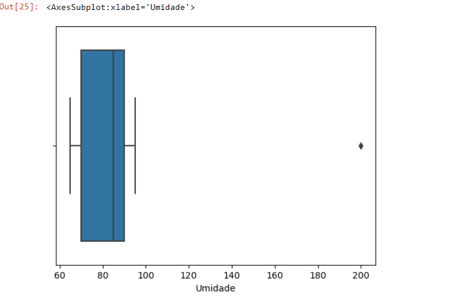
Em seguida, utilizei a função 'loc' para verificar o valor que estava acima de 130. Calculei a mediana e utilizei novamente a função 'loc' para definir o novo valor.
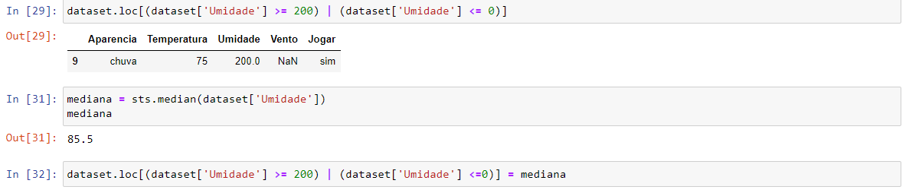

# Coluna Temperatura
Para a coluna 'Temperatura', realizei os mesmos procedimentos. Verifiquei se havia algum valor fora do padrão e utilizei a função 'loc' para definir o valor de acordo com a mediana.
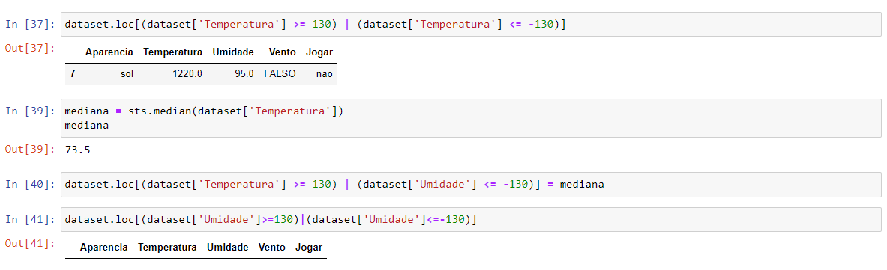
Posteriormente, analisei novamente a tabela e observei que havia um valor nulo. Calculei a mediana e defini o novo valor como a mediana.
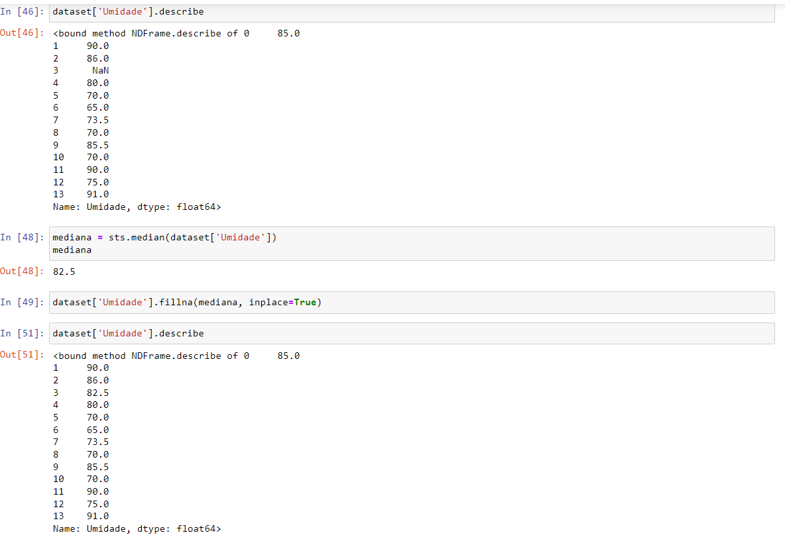

# Coluna Vento
Na coluna 'Vento', percebi que o erro era devido à presença de números nas células. Iniciei o tratamento substituindo esses valores.
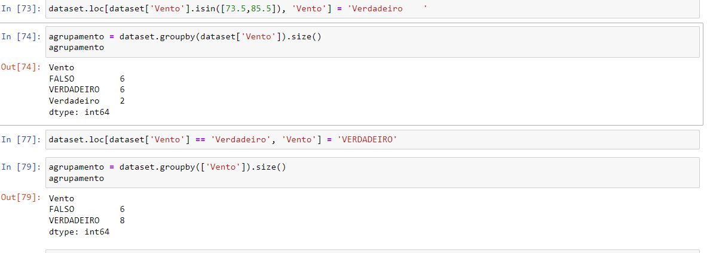

# Coluna Jogar
Na coluna 'Jogar', as únicas alterações foram substituir os números por 'sim'.
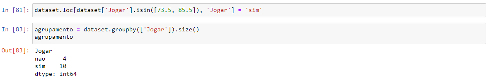"